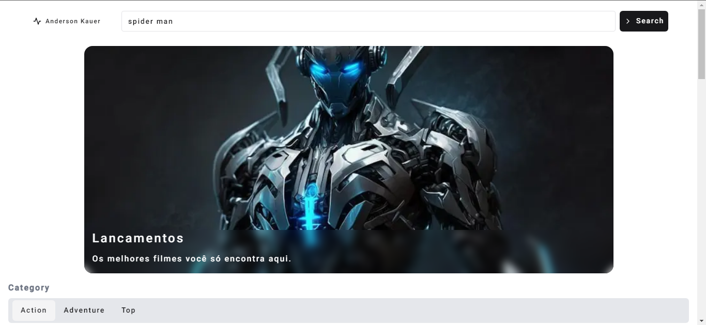
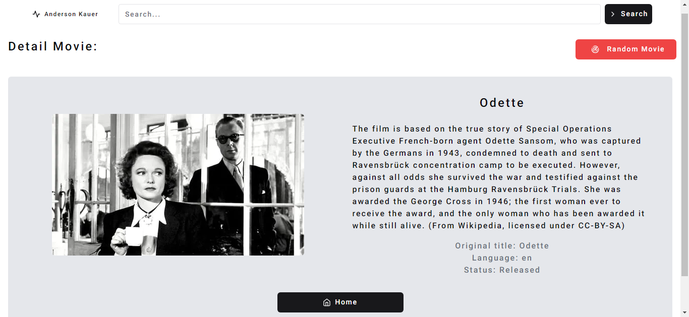
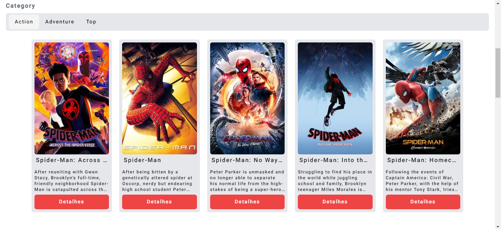
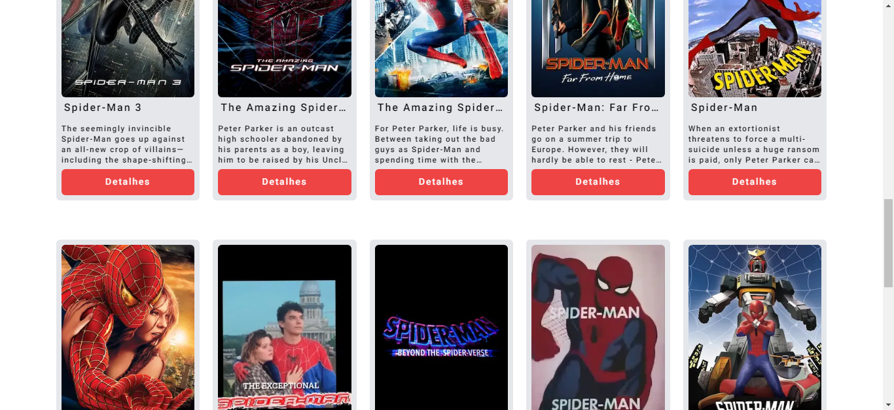
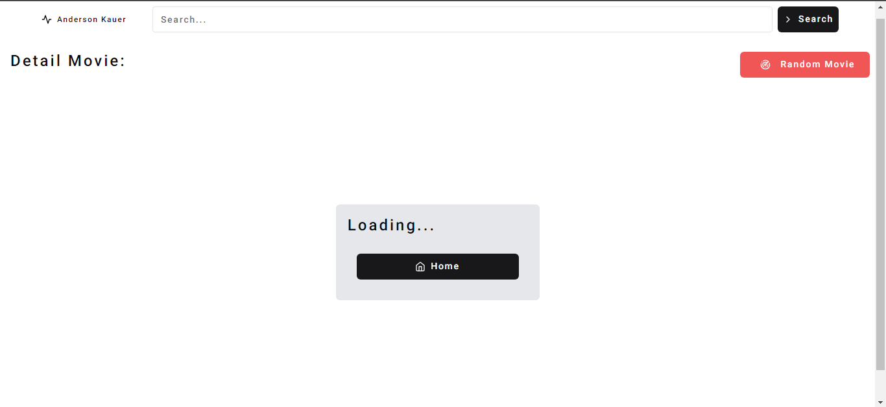

veja aqui: (https://consumindo-api-filme.vercel.app)

# Consumindo API de Filmes com Next.js - React.js - Tailwind ...

## Descrição

Este projeto é uma aplicação web desenvolvida com Next.js que consome uma API de filmes. A aplicação permite aos usuários explorar filmes em várias categorias, como Ação, Aventura e os filmes mais populares. Além disso, os usuários podem pesquisar qualquer filme específico usando um campo de pesquisa.

## Funcionalidades

- Lista de filmes em categorias como Ação, Aventura e Top.
- Campo de pesquisa para pesquisar filmes por título.
- Exibição de detalhes do filme, como título, sinopse, classificação, data de lançamento, etc.
- Layout responsivo para uma experiência de usuário agradável em dispositivos móveis e desktop.

## Tecnologias Utilizadas

- Next.js
- React.
- TypeScript
- Tailwind CSS
- API de Filmes: TMDb API, uma API que fornece informações sobre filmes.
- CSS
- shadcn/ui

## Page Detail

### Nesta página, você pode sortear um filme aleatório.

